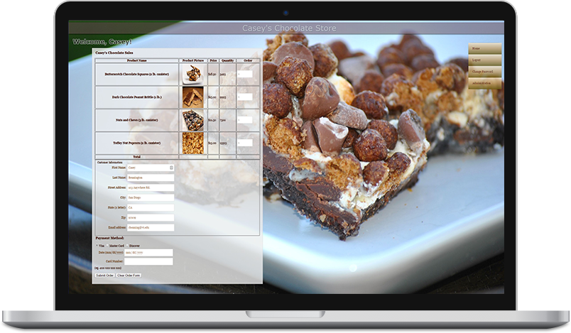

# Chocolate-Store
Chocolate Store Shopping cart application.

PHP application with integrated login, admin, shopping cart, and hosted database.

This application allows a user to register with the application, confirm their registration, login, change their password, order products, and receive confirmation of their purchase.
It also has admin functionality that allows a designated user to add, edit, and delete products as well has manage the orders and customers.

This was my first ecommerce application and I definitely learned a great deal from it.

I no longer maintain this application but it should be noted there are a number of bugs that exist within the codebase, however, they do not interfer with the core functionality.

[See it here.](https://caseys-chocolate-store.herokuapp.com/)
